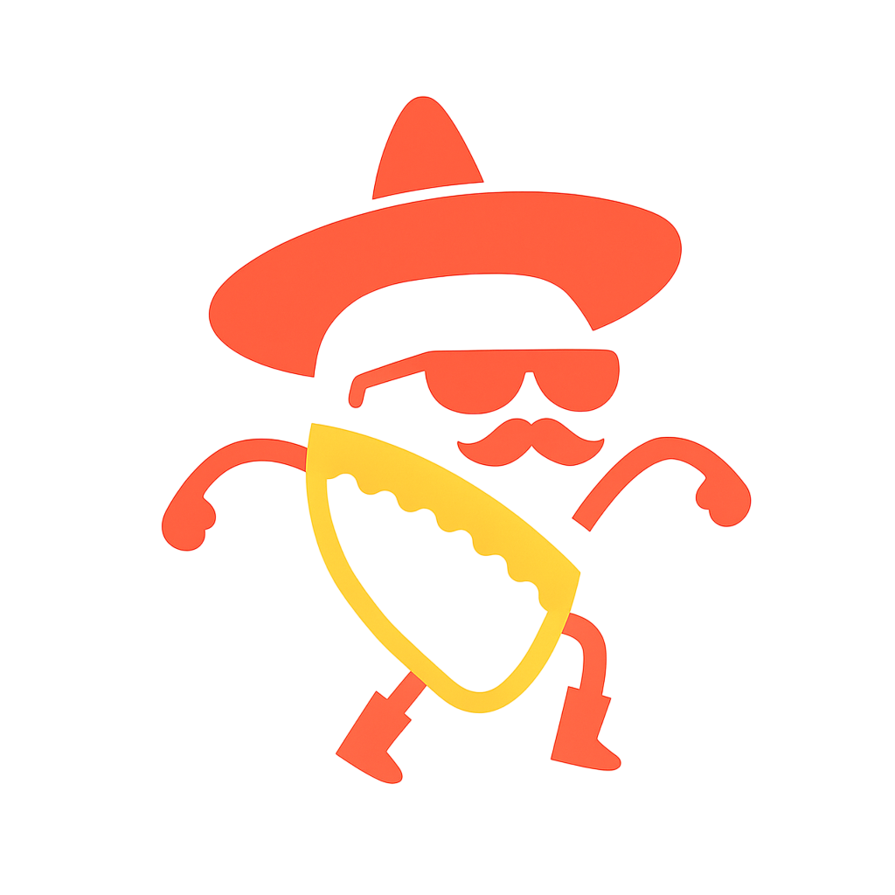

# 🌮 El Picantito
**Auténticos Tacos Mexicanos en Colombia**



## 📋 Descripción
El Picantito es una aplicación web desarrollada con Spring Boot que simula una taquería colombiana especializada en auténticos tacos mexicanos. Este proyecto fue desarrollado para la clase de Desarrollo Web.

## 🎨 Paleta de Colores

### Tema Oscuro de Alto Contraste (Dark High Contrast)


| Color | Hex | Variable CSS | Uso |
|-------|-----|--------------|-----|
|  | `#FFECE5` | `--md-sys-color-primary` | Color primario |
|  | `#1A110E` | `--md-sys-color-surface` | Fondos principales |
|  | `#FFFFFF` | `--md-sys-color-on-surface` | Texto sobre superficies |
|  | `#FFB597` | `--md-sys-color-primary-container` | Contenedores primarios |
|  | `#FFC107` | Accent Color | Color de acentos (warning) |

### Variaciones de Superficie
| Superficie | Hex | Variable CSS |
|------------|-----|--------------|
|  | `#38221A` | `--md-sys-color-surface-container` |
|  | `#443935` | `--md-sys-color-surface-container-high` |
|  | `#504440` | `--md-sys-color-surface-container-highest` |

## 🚀 Tecnologías Utilizadas

- **Backend:** Spring Boot 3.2.0
- **Frontend:** HTML5, CSS3, JavaScript
- **Framework CSS:** Bootstrap 5.3.5
- **Icons:** Bootstrap Icons 1.10.5
- **Fuentes:** Google Fonts (Playfair Display, Inter)
- **Java:** JDK 21
- **Build Tool:** Maven

## 📁 Estructura del Proyecto

```
ElPicantito/
├── src/
│   ├── main/
│   │   ├── java/
│   │   │   └── com/picantito/picantito/
│   │   │       ├── PicantitoApplication.java
│   │   │       └── controllers/
│   │   └── resources/
│   │       ├── static/
│   │       │   ├── styles/
│   │       │   │   ├── styles.css
│   │       │   │   ├── auth.css
│   │       │   │   ├── creaTaco.css
│   │       │   │   └── css/
│   │       │   │       ├── dark-hc.css
│   │       │   │       ├── dark.css
│   │       │   │       ├── light.css
│   │       │   │       └── ...
│   │       │   ├── js/
│   │       │   │   └── script.js
│   │       │   └── images/
│   │       │       └── LogoMinimalist.png
│   │       └── templates/
│   │           └── html/
│   │               ├── home.html
│   │               ├── tienda.html
│   │               ├── sobre-nosotros.html
│   │               ├── logIn.html
│   │               └── registry.html
│   └── test/
├── target/
├── pom.xml
└── README.md
```

## 🎯 Funcionalidades

### ✅ Páginas Implementadas
- **🏠 Inicio (home.html):** Página principal con carrusel de promociones
- **🛒 Tienda (tienda.html):** Catálogo de productos con filtros
- **👥 Sobre Nosotros (sobre-nosotros.html):** Historia y equipo
- **🔐 Login/Registro:** Sistema de autenticación

### 🎨 Características de Diseño
- **Tema Oscuro de Alto Contraste:** Optimizado para accesibilidad
- **Navegación Minimalista:** Solo iconos con tooltips
- **Responsive Design:** Compatible con todos los dispositivos
- **Material Design 3:** Sistema de colores moderno
- **Animaciones Suaves:** Transiciones CSS elegantes

## 🛠️ Instalación y Ejecución

### Prerrequisitos
- Java 21 o superior
- Maven 3.6+

### Pasos para ejecutar

1. **Clonar el repositorio:**
```bash
git clone [URL-del-repositorio]
cd ElPicantito
```

2. **Compilar el proyecto:**
```bash
./mvnw clean compile
```

3. **Ejecutar la aplicación:**
```bash
./mvnw spring-boot:run
```

4. **Acceder a la aplicación:**
```
http://localhost:8080/home
```

### En Windows
```cmd
mvnw.cmd clean compile
mvnw.cmd spring-boot:run
```

## 📄 Páginas Disponibles

| Ruta | Descripción | Características |
|------|-------------|-----------------|
| `/home` | Página principal | Carrusel, características, sección "sobre nosotros" |
| `/tienda` | Catálogo de productos | Lista de tacos con filtros |
| `/sobre-nosotros` | Información de la empresa | Historia, valores, equipo |
| `/login` | Inicio de sesión | Formulario de autenticación |
| `/registry` | Registro de usuarios | Formulario de registro |

## 🎨 Sistema de Temas

El proyecto incluye múltiples temas basados en Material Design 3:

- **Dark High Contrast** (Activo)
- **Dark Medium Contrast** 
- **Dark Standard**
- **Light High Contrast**
- **Light Medium Contrast**
- **Light Standard**

## 👥 Equipo de Desarrollo

- **Javier Aldana** - Chef Principal & Developer
- **David Roa** - Fundador & Backend Developer  
- **Jorge Sierra** - Chef Secundario & Frontend Developer
- **Juan Diego Muñoz** - Gerente General & UI/UX Designer

## 📞 Contacto

📍 **Dirección:** Calle 123 #45-67, Bogotá, Colombia  
📱 **Teléfono:** +57 300 365 8312  
📧 **Email:** hola@elpicantito.com  

---

### 🌶️ *"El sabor auténtico mexicano, ahora en Colombia"*

**© 2025 El Picantito. Todos los derechos reservados.**
